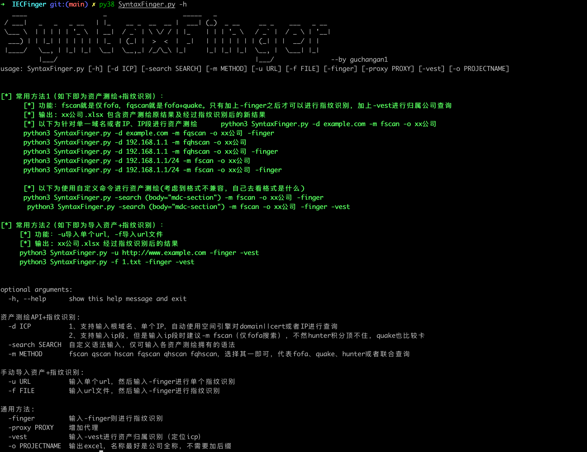
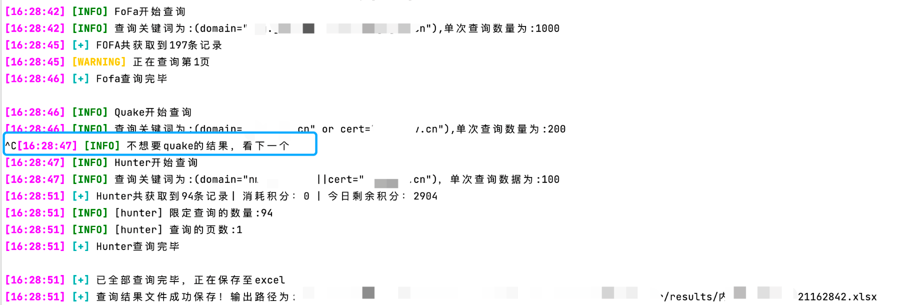

# SyntaxFinger

​	**在整个红队攻防体系中，打点是最基础也是最重要的一步，在实际的攻防比赛中，由于资产数量庞大、红队人员稀缺以及时间紧迫等各种因素，导致打点的效果常常不尽如人意。在打点阶段快人一步、率先进入内网并获得更高的分数对于红队来说非常关键，打点的质量和效率直接影响着整个红队的表现和成绩。打点实质就是在众多的资产中脆弱资产与重点攻击系统，说白了，只要比别人队伍搜集资产的数目更多，比别人找到脆弱的资产更快，在打点方面就更胜一筹。**

- **一般打点场景**
  - **根域名获取全量资产**：一般情况下都是拿到根域名，然后直接在资产测绘引擎获取到全量的URL资产，然后识别到通用指纹，再做漏洞利用。
  - **指纹获取对应资产归属：**有了某个指纹，但不知道对应的备案名，还得一个个确认归属。
- **本工具解决痛点**
  - 标准化整合三大主流资产测绘引擎（fofa、quake、hunter）的语法差异，构建统一查询接口，用户只需输入一个根域名即可快速获取与目标有关的所有资产列表。
  - 编写多种ICP反查接口，一键获取资产归属。

## 0x00 功能概述

​	**本工具不去主动的做端口扫描，通过聚合了三大资产测绘引擎接口语法，快速获取与目标有关的所有资产URL列表，并进行一键指纹识别（通用系统指纹、ICP归属等），筛出高价值及脆弱资产。**

**✅多源数据智能聚合快速获取资产**

- **✅通过标准化整合三大主流资产测绘引擎（fofa、quake、hunter）的语法差异，构建统一查询接口，用户可通过单一指令实现跨平台资产检索，快速获取与目标有关的所有资产列表**
- **✅仅需提供公司全称与根域名或者IP**，便可一键获取对应资产（url、ip、domain），并进行数据库存储。
- ✅兼容域名/IP/IP段输入格式，无需多余参数。（注：IP段仅支持fofa，不是其他不支持，只是太费钱）


**✅通用系统指纹识别**

- ✅url资产去重扫描
- ✅指纹库集成（Ehole指纹库等）
- ✅后台系统、登录表单识别
- ✅IP资产归属识别ICP备案
- ✅URL资产归属识别ICP备案
- ✅CDN多方位检测
- ✅web语言识别



## 0x01 更新内容

**2023.9.17  发版v1.0**

**2023.9.18  解决了fofa、quake、hunter可能因为网络原因导致数据获取失败的情况。**

**2023.9.19  优化了获取favicon的方式**

**2023.9.21  优化了fofa查询，修复了通过cert语法查询导致的域名脏数据问题**

**2023.9.21  优化了指纹识别时输出状态码颜色问题**

**2023.9.21  优化了api查询代码逻辑，使api结果与excel输出解耦**

**2023.9.21  增加了当查询时间过长（api服务端问题或者本地网络问题）时，可以手动ctrl-c进行下一个api查询**



**2023.9.22 增加了后台系统、登录表单识别**

**2023.10.12 优化了指纹识别逻辑，增加0day||1day判断提示**

**2023.10.12 优化了指纹格式**

**2023.10.30 增加归属识别功能，可一键获取url对应的icp公司名称，通过使用 -vest开启**

**2023.10.31 修复指纹识别逻辑校验bug，解决header报错**

**2023.10.31 代码解耦，资产测绘、指纹识别、归属识别、excel导出逻辑分离**

**2023.10.31 记录指纹识别时请求失败的url，生成excel**

**2023.10.31 修复指纹识别重大逻辑bug，解决因day_type参数导致的url获取失败，导致无法获取指纹bug**

**2023.10.31 更新UA头为bing机器人**

**2023.11.06 增加web语言识别功能**

**2023.11.13 增加CDN多维度识别功能（header、ASN、C段、CNAME）**

**2023.12.25 修复quake获取结果url仅为host的问题**

**2024.5.22 增加302判断，针对302跳转的url也会请求一次**

**2024.5.29 修复了当server头为空时报错object of type 'NoneType' has no len()**

**2024.6.13 增加动态代理功能，使用-proxy 1 为代理池，  2为burp**

**2024.09  停更，已不从事演练相关活动**

**2025.3.12 开源**


## 0x02 使用方法

### 2.1 使用前提：

```
pip install -r requirements.txt -i https://pypi.tuna.tsinghua.edu.cn/simple

进入目录config/config.py 填写资产测绘引擎的api-key
```

### 2.2 创建任务最佳实践1（如下即为资产测绘+指纹识别）：

- 功能：fscan就是仅fofa，fqscan就是fofa+quake。**只有加上-finger之后才可以进行指纹识别，加上-vest进行归属公司查询**
  - -d ICP 
                  - 支持输入根域名、单个IP，自动使用空间引擎对domain||cert或者IP进行查询
                  - 支持输入ip段，但是输入ip段时建议-m fscan（仅fofa搜索），不然hunter积分顶不住，quake也比较卡
  - -search SEARCH  自定义语法输入，仅可输入各资产测绘拥有的语法
  - -m METHOD       fscan qscan hscan fqscan qhscan fqhscan，选择其一即可，代表fofa、quake、hunter或者联合查询
- 输出: 
  - -o xx公司 
    - 生成xx公司.xlsx，包含资产测绘原结果及经过指纹识别后的新结果

#### 2.2.1 针对单一域名或者IP、IP段进行资产测绘

​      python3 SyntaxFinger.py -d example.com -m fscan -o xx公司
​      python3 SyntaxFinger.py -d example.com -m fqscan -o xx公司 -finger

​      python3 SyntaxFinger.py -d 192.168.1.1 -m fqhscan -o xx公司
​      python3 SyntaxFinger.py -d 192.168.1.1 -m fqhscan -o xx公司 -finger

​      python3 SyntaxFinger.py -d 192.168.1.1/24 -m fscan -o xx公司
​      python3 SyntaxFinger.py -d 192.168.1.1/24 -m fscan -o xx公司 -finger
​      python3 SyntaxFinger.py -d 192.168.1.1/24 -m fscan -o xx公司 -finger -vest


####  2.2.2 使用自定义命令进行资产测绘

​      python3 SyntaxFinger.py -search (body="mdc-section") -m fscan -o xx公司 -finger
​      python3 SyntaxFinger.py -search (body="mdc-section") -m fscan -o xx公司 -finger -vest

####  2.2.3 针对批量域名建议结合sh脚本使用

- 为什么不直接导入多个根域名？
  - 集成三大引擎，由于是命令行版本的，多个根域名跑一下数据不仅你自己看不过来，而且中间一个断了你都不知道。

**linux|mac**

run.sh

```
while read line
do
    project=`echo $line | awk -F " " '{print $1}'`
    host=`echo $line | awk -F " " '{print $2}'`
    echo $host,$project
    python3 SyntaxFinger.py -d $host -m fqhscan -o $project$host -finger -proxy 1 
done < target.txt
```

**windows:**

run.psl

```
    Get-Content target.txt | ForEach-Object {
        $line = $_
        $project = ($line -split " ")[0]
        $host = ($line -split " ")[1]
        Write-Output "$host,$project"
        python SyntaxFinger.py -d $host -m fqhscan -o $project$host -finger -proxy 1 
    }
```

target.txt

```
北京xx科技有限公司 example.com.cn
北京xx科技有限公司 example.com
```


### 2.3 创建任务最佳实践2（如下即为导入资产+指纹识别）：

- 功能：-u导入单个url，-f导入url文件， -finger进行指纹识别，-vest进行归属识别

  -  -u URL          输入单个url，然后输入-finger进行单个指纹识别
  -  -f FILE         输入url文件，然后输入-finger进行指纹识别

- 输出: 

  - xx公司.xlsx 经过指纹识别后的结果

     

  python3 SyntaxFinger.py -u http://www.example.com -finger -vest
  python3 SyntaxFinger.py -f url.txt -finger -vest

## 0x03 指纹编写方法

指纹格式如下:

1. manufacturer：厂商名称
2. product：产品名称
3. finger：具体指纹
   1. 指纹名称（随意命名，尽量与指纹有关系即可）
      1. method：三种识别方式 (分别为：keyword（使用关键词查询）、faviconhash（iconhash）、title（标题）)
      2. location：指纹识别位置（提供两个位置，一个为body，一个为header，faviconhash为null）
      3. keyword：关键字（具体关键字、favicon图标hash）

4、relation：关系类型，支持【指纹名称 and 指纹名称】,否则为单个匹配

5、day_type：漏洞类型，-1为无day  0为0day  1为1day

6、team：随意写，个人id也行，团队id也行

以明源云为例：

```json
{
    "manufacturer": "深圳市彩讯科技有限公司",
    "product": "Richmail 邮件系统",
    "finger": {
      "keyword_title": {
        "method": "keyword",
        "position": "title",
        "match": "RichMail"
      },
      "keyword_body": {
        "method": "keyword",
        "position": "body",
        "match": "0;url=/webmail/"
      },
      "keyword_body_2": {
        "method": "keyword",
        "position": "body",
        "match": "richmail.config.js"
      },
      "keyword_body_3": {
        "method": "keyword",
        "position": "body",
        "match": "login"
      }
    },
    "relation": [
      "keyword_title",
      "keyword_body",
      "keyword_body_2 and keyword_body_3"
    ],
    "day_type": -1,
    "team": "公开"
  }
```


## 0x04 Thanks

https://github.com/EASY233/Finger

https://github.com/EdgeSecurityTeam/EHole

@zzzzzzzzzzzzzzzzzzz

本项目的开发者、提供者和维护者不对使用者使用工具的行为和后果负责，工具的使用者应自行承担风险。

本项目由于开发者工作原因暂停更新，但功能皆可正常使用，开源给大家参考。
